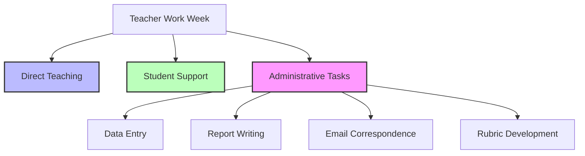

# GPT-5.4 and the Future of Teacher Workload: Why This Matters More Than You Think

*How the latest AI breakthrough could finally free teachers from the busy work that's eating their evenings*

---

## The Numbers That Should Make Every Teacher Excited

OpenAI has just released GPT-5.4, and buried beneath the technical fanfare is something that should make every educator pay attention: this model can now do things that were previously the exclusive domain of skilled professionals—and it does them with **83% accuracy** on real-world professional work tasks.

Let me put that in context. When OpenAI tested GPT-5.4 against actual professional work across 44 different occupations—the kind of work that people spend years training to do—this AI matched or exceeded human professionals in **83 out of every 100 tasks**. That's up from 71 out of 100 with the previous version.

For teachers drowning in administrative work, here's the number that matters: **18% fewer errors** than the previous version, and **33% fewer false claims**. This isn't a toy. This is a tool that can reliably handle the kinds of tasks that have been piling up on teachers' desks—and their kitchen tables at 10pm.

---

## What Actually Changes in a Classroom

The biggest shift isn't the AI itself. It's what the AI can now *do*.

GPT-5.4 is the first OpenAI model with genuine **computer-use capabilities**. That means it doesn't just generate text—it can actually operate software. It can click buttons, navigate websites, fill in spreadsheets, and manipulate documents. For a teacher, this translates to something concrete: the model can now handle the tedious workflows that have been manual for decades.

Consider the typical week of a Year 5 teacher. Before Friday's assembly, there's data entry into spreadsheets. There's parent emails to draft. There's assessment rubrics to align. There's feedback to write. These aren't the reasons most teachers got into education—they're the busy work that accumulates like traffic noise.

GPT-5.4 changes this equation. Here's what the data shows:

| Capability | Improvement Over Previous Version |
|-----------|--------------------------------|
| Professional work tasks (GDPval) | 83% vs 71% |
| Spreadsheet modelling tasks | 87% vs 68% |
| Computer use (OSWorld) | 75% vs 47% |
| Factual accuracy | 33% fewer false claims |
| Error rate | 18% fewer errors |

A model that can reliably work with spreadsheets and presentations at an 87% accuracy level isn't replacing teacher judgment—it's eliminating the hours spent formatting cells and aligning columns.

---

## The Busy Work That's Been Killing Teacher Wellbeing

There's a persistent myth that teachers who use AI are somehow "cheating" or shortcuts. But let's be honest about what busy work actually is: it's the gap between what teachers were trained to do—teach, inspire, support students—and the administrative machinery that has steadily consumed their time.

Australian teachers work an average of **50+ hours per week**, with many reporting that only about half of that time is actually spent on teaching and student interaction. The rest? Meetings, compliance paperwork, data entry, report writing, and the endless cycle of assessment.

GPT-5.4 is explicitly designed to close that gap. OpenAI specifically highlighted improvements in **spreadsheets, presentations, and documents**—the exact formats that consume teacher evenings. The model's spreadsheet capabilities now score 87% on tasks that junior investment bankers tackle. For a teacher generating progress reports or analysing assessment data, this isn't futuristic. It's *this term*.

The administrative quadrant is where AI tools like GPT-5.4 can genuinely help—not by replacing the teaching, but by handling the documentation that surrounds it.

---

## Beyond the Hype: What Teachers Actually Need

Here's what separates GPT-5.4 from earlier AI tools that promised revolution but delivered novelty:

**1. Reliability matters more than capability.**
A tool that's impressive but unreliable creates more work. GPT-5.4's 33% reduction in false claims means teachers spend less time checking and correcting AI output—and more time trusting it to get things right the first time.

**2. Context windows matter.**
GPT-5.4 supports up to **1 million tokens of context**. For a teacher, this means the AI can work with an entire term's worth of assessment data, student notes, and curriculum documents all at once. It can understand the full picture rather than processing fragments.

**3. Computer use changes the workflow.**
Previous AI tools could suggest what to write. GPT-5.4 can actually *do* the formatting, filing, and data entry. This isn't just faster—it changes what tasks are even worth automating. A teacher can now say "organise these assessment results by student and generate the required reports" and actually mean it.

---

## The Teacher-Specific Angle

OpenAI has also been expanding **ChatGPT for Teachers**, a dedicated workspace launched in late 2025 that's specifically configured for K-12 education. It includes administrative controls for school leaders, privacy protections for student data, and tools designed for lesson planning, material adaptation, and parent communications.

The timing matters. Research from the EdWeek Research Center shows that **61% of teachers** were using AI-driven tools in their classrooms by mid-2025—more than double the rate from 2023. The technology is already in teachers' hands. The question is whether it's being used to reduce workload or add another thing to manage.

GPT-5.4's improvements in accuracy and reliability tip the balance toward genuine workload reduction. When a tool makes 18% fewer errors, it crosses the threshold from "might help" to "worth using".

---

## The Realistic View

This isn't a magic solution. Teachers still need to review, approve, and adapt AI-generated content. There are privacy considerations, school policies, and the irreducible fact that education is fundamentally about human relationships.

But the trajectory is clear. Each version of these models gets better at the tedious tasks that have been accumulating on teachers' desks. The question isn't whether AI will help with busy work—it's whether teachers will have the time and training to use these tools effectively.

For the first time, the AI being released isn't just impressive in a demo—it's reliable enough to genuinely use in the workflows that define a teacher's week. And with OpenAI's revenue now exceeding **$25 billion annually**, the investment in making these tools better isn't slowing down.

The teachers who figure out how to work with these tools thoughtfully—rather than resisting or over-relying on them—will be the ones who reclaim their evenings.

---

## What This Means for Your Classroom

If you're a teacher wondering whether this matters: it does. The specific improvements in GPT-5.4—spreadsheet work, document creation, fewer errors, computer use—map directly to the tasks that eat your evenings.

The practical steps are straightforward:

1. **Start small.** Use AI for one administrative task this week. See how it goes.
2. **Focus on busy work first.** Data entry, formatting, routine communications—these are the biggest time sinks and where AI now excels.
3. **Trust but verify.** The 33% improvement in accuracy matters, but you're still the expert on your students.
4. **Share what works.** Teacher networks are where the best practices emerge.

The technology is ready. The question is how we choose to use it.

---

*This analysis draws on OpenAI's GPT-5.4 release documentation, TechCrunch reporting, EdWeek Research Center data, and the GDPval benchmark methodology. All statistics cited are from OpenAI's published evaluations.*

---

**Category:** AI in Education | **Tags:** #GPT5 #teacherworkload #edtech #AI #OpenAI
